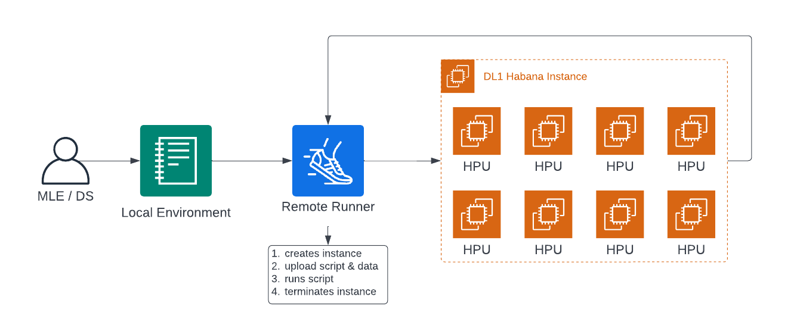

# Remote Runner 

Remote Runner is an easy pythonic way to migrate your python training scripts from a local environment to a powerful cloud-backed instance to efficiently scale your training, save cost & time, and iterate quickly on experiments in a parallel containerized way. 

**How does Remote Runner work?**

1. Creating all required cloud resources
2. Migrating your script to the remote machine
3. Executing your script
4. making sure the instance is terminated again.



## Getting started

```python
pip install rm-runner
```

**Permissons**

To use `EC2RemoteRunner` you need to following permissions:
* create/delete keypairs
* create/delete secruity groups
* add inbound/ingress rules to security groups
* create/start/terminate instances (with ebs)

### Habana Gaudi example

```python
from rm_runner import EC2RemoteRunner

runner = EC2RemoteRunner(instance_type="dl1.24xlarge", profile="hf-sm", region="us-east-1")

runner.launch(command="hl-smi")
```

**expected output**

```bash
2022-07-21 10:00:09,898 | INFO | Found credentials in shared credentials file: ~/.aws/credentials
2022-07-21 10:00:10,812 | INFO | Created key pair: rm-runner-abdk
2022-07-21 10:00:11,621 | INFO | Created security group: rm-runner-abdk
2022-07-21 10:00:13,227 | INFO | Launched instance: i-03dcc3b5f53cb946a
2022-07-21 10:00:13,230 | INFO | Waiting for instance to be ready...
2022-07-21 10:00:29,252 | INFO | Instance is ready. Public DNS: ec2-3-93-4-123.compute-1.amazonaws.com
2022-07-21 10:00:29,267 | INFO | Setting up ssh connection...
2022-07-21 10:01:49,292 | INFO | Setting up ssh connection...
2022-07-21 10:02:05,434 | INFO | Setting up ssh connection...
2022-07-21 10:02:10,542 | INFO | Setting up ssh connection...
2022-07-21 10:02:10,766 | INFO | Connected (version 2.0, client OpenSSH_8.2p1)
2022-07-21 10:02:11,840 | INFO | Authentication (publickey) successful!
2022-07-21 10:02:11,840 | INFO | Pulling container: vault.habana.ai/gaudi-docker/1.4.1/ubuntu20.04/habanalabs/pytorch-installer-1.10.2:1.4.1-11...
2022-07-21 10:02:20,460 | INFO | Executing: docker run --runtime=habana -e HABANA_VISIBLE_DEVICES=all -e OMPI_MCA_btl_vader_single_copy_mechanism=none --cap-add=sys_nice --net=host --ipc=host -v /home/ubuntu:/home/ubuntu/rm-runner --workdir=/home/ubuntu/rm-runner vault.habana.ai/gaudi-docker/1.4.1/ubuntu20.04/habanalabs/pytorch-installer-1.10.2:1.4.1-11 hl-smi
+-----------------------------------------------------------------------------+
| HL-SMI Version:                            hl-1.4.1-rc-fw-35.0.2.0          |
| Driver Version:                                      1.4.0-d8f95f4          |
|-------------------------------+----------------------+----------------------+
| AIP  Name        Persistence-M| Bus-Id        Disp.A | Volatile Uncorr. ECC |
| Fan  Temp  Perf  Pwr:Usage/Cap|         Memory-Usage | AIP-Util  Compute M. |
|===============================+======================+======================|
|   0  HL-205              N/A  | 0000:20:1d.0     N/A |                   0  |
| N/A   35C   N/A   102W / 350W |    512Mib / 32768Mib |     2%           N/A |
|-------------------------------+----------------------+----------------------+
|   1  HL-205              N/A  | 0000:a0:1d.0     N/A |                   0  |
| N/A   36C   N/A   101W / 350W |    512Mib / 32768Mib |     1%           N/A |
|-------------------------------+----------------------+----------------------+
|   2  HL-205              N/A  | 0000:a0:1e.0     N/A |                   0  |
| N/A   33C   N/A   105W / 350W |    512Mib / 32768Mib |     3%           N/A |
|-------------------------------+----------------------+----------------------+
|   3  HL-205              N/A  | 0000:90:1d.0     N/A |                   0  |
| N/A   32C   N/A    97W / 350W |    512Mib / 32768Mib |     0%           N/A |
|-------------------------------+----------------------+----------------------+
|   4  HL-205              N/A  | 0000:90:1e.0     N/A |                   0  |
| N/A   35C   N/A   101W / 350W |    512Mib / 32768Mib |     1%           N/A |
|-------------------------------+----------------------+----------------------+
|   5  HL-205              N/A  | 0000:10:1d.0     N/A |                   0  |
| N/A   34C   N/A    93W / 350W |    512Mib / 32768Mib |     0%           N/A |
|-------------------------------+----------------------+----------------------+
|   6  HL-205              N/A  | 0000:10:1e.0     N/A |                   0  |
| N/A   36C   N/A   108W / 350W |    512Mib / 32768Mib |     4%           N/A |
|-------------------------------+----------------------+----------------------+
|   7  HL-205              N/A  | 0000:20:1e.0     N/A |                   0  |
| N/A   33C   N/A   101W / 350W |    512Mib / 32768Mib |     1%           N/A |
|-------------------------------+----------------------+----------------------+
| Compute Processes:                                               AIP Memory |
|  AIP       PID   Type   Process name                             Usage      |
|=============================================================================|
|   0        N/A   N/A    N/A                                      N/A        |
|   1        N/A   N/A    N/A                                      N/A        |
|   2        N/A   N/A    N/A                                      N/A        |
|   3        N/A   N/A    N/A                                      N/A        |
|   4        N/A   N/A    N/A                                      N/A        |
|   5        N/A   N/A    N/A                                      N/A        |
|   6        N/A   N/A    N/A                                      N/A        |
|   7        N/A   N/A    N/A                                      N/A        |
+=============================================================================+
2022-07-21 10:04:00,641 | INFO | Terminating instance: i-03dcc3b5f53cb946a
2022-07-21 10:05:48,297 | INFO | Deleting security group: rm-runner-abdk
2022-07-21 10:05:49,891 | INFO | Deleting key: rm-runner-abdk
2022-07-21 13:29:12,489 | INFO | Total time:       302s
2022-07-21 13:29:12,489 | INFO | Startup time:     165s
2022-07-21 13:29:12,490 | INFO | Execution time:   43s
2022-07-21 13:29:12,490 | INFO | Termination time: 94s
2022-07-21 13:29:12,490 | INFO | Estimated cost:  $1.1
```

